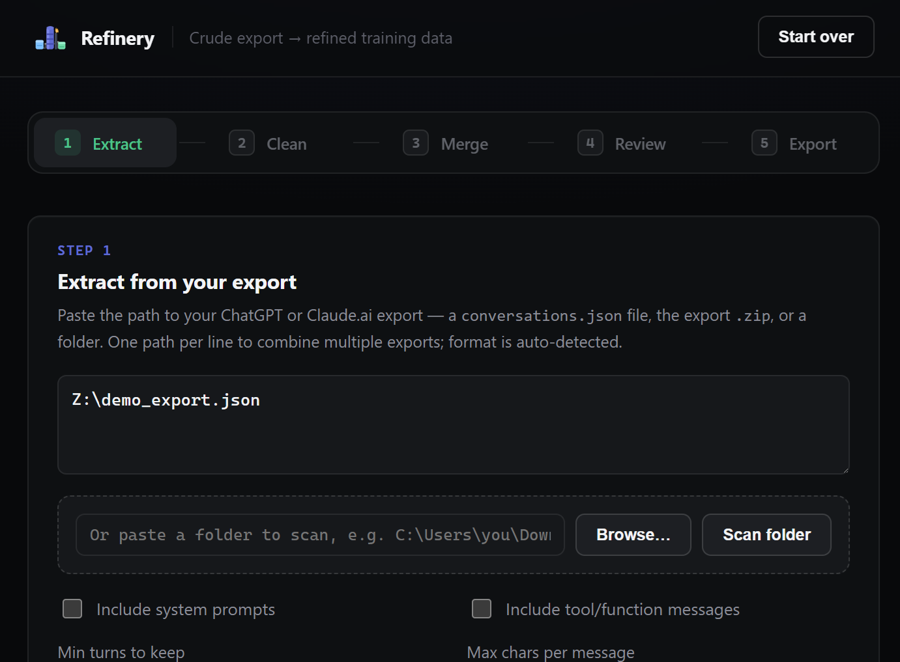
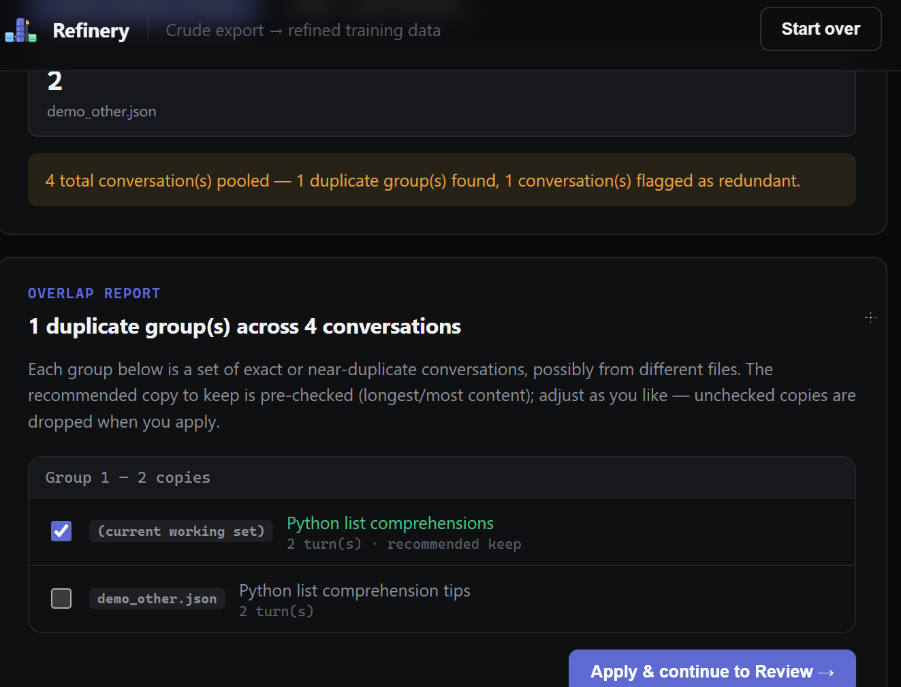

# Your Chat History Is a Gold Mine. Here's Why You Can't Use It Yet.

### Meet Refinery, a local tool that turns messy ChatGPT and Claude exports into training data you can actually trust.

If you've talked to ChatGPT or Claude every day for the last year, you're sitting on something valuable: hundreds of real conversations that show, in detail, how you think, what you ask, and how you like answers phrased. That's exactly the raw material LoRA fine-tuning wants — pairs of real prompts and real responses, at scale, in your own voice.

There's just one problem. The file OpenAI or Anthropic emails you when you request your data isn't a dataset. It's an export. And the gap between those two words is bigger than it looks.

## What's actually in that ZIP file

Open `conversations.json` from a ChatGPT export and you won't find a clean list of question-answer pairs. You'll find a tree. Every message is a node with a parent and a list of children, because ChatGPT lets you edit a message and branch off in a new direction — and the export keeps *every* branch, not just the one you ended up reading. Buried in there are also system messages, hidden scaffolding messages, tool calls, and citation markers that were never meant to be read as plain text.

Claude's export is friendlier — a flat list of messages per conversation — but it has its own gaps: no schema guarantees, inconsistent content-block structures across export versions, and zero validation that what comes out the other end is actually trainable.

Neither format resembles what a LoRA fine-tuning framework wants to see, which is almost always some version of ShareGPT's `{"from": "human" | "gpt", "value": "..."}` turn structure — a clean, alternating conversation with nothing else attached.

So before any of your chat history can train a model, someone has to walk that tree, pick the live branch, strip the noise, and reshape it. Do that by hand across a few hundred conversations and you'll lose a weekend. Skip it, and you'll feed a fine-tuning run a dataset full of duplicate conversations, empty turns, and "As an AI language model, I cannot..." boilerplate repeated a hundred times — which is a great way to teach a model to sound like a customer service bot instead of you.

## Why the existing tools don't solve this

It's worth being precise here, because there's a real tool already doing excellent work one step downstream: **Unsloth**. Its `standardize_sharegpt()` helper and training pipeline expect a dataset that's *already* in a clean conversational format — they handle turning that dataset into tokenized, model-ready batches for fine-tuning. That's a different job. Unsloth (and Axolotl, and LLaMA-Factory) all assume the messy part is done. None of them parse a raw ChatGPT export tree, catch duplicate conversations, or validate that your turns strictly alternate before training starts.

That gap — from raw export to clean, validated ShareGPT JSON — is what Refinery fills.

## What Refinery does

Refinery is a small local pipeline, five steps, no account, no cloud:

**Extract** parses the raw export — ChatGPT's tree, Claude's flat list, either one, mixed freely in the same run — and turns it into a flat list of alternating human/assistant turns. It walks the *active* branch of ChatGPT's tree (not every dead-end edit), strips hidden system scaffolding and citation markers, and drops empty or tool-only turns unless you ask to keep them.

**Clean** removes the junk that survives extraction: exact duplicate conversations, near-duplicate conversations (using word-overlap similarity, so two conversations that are 95% the same don't both make it into training), canned AI disclaimers at the start of assistant turns, and conversations too short or too thin on content to teach a model anything.

**Merge** is for the moment you have more than one dataset — an export from six months ago and one from today, or a batch a teammate cleaned separately — and want to combine them without training on the same conversation twice. It pools every file, groups exact and near-duplicates *across* files (even chains of three or four copies of the same conversation), and recommends which copy to keep.

**Review** is a full hands-on editor: browse every conversation, fix a clumsy turn, delete something that shouldn't be there, add a conversation by hand. Nothing here is automatic guesswork you have to trust blindly — you can see and change every line before it becomes training data.

**Export** is the only step that writes to disk, and it always validates first: every turn has a real role, every turn has real text, turns strictly alternate, nothing starts on the wrong speaker. If any of that fails, *nothing is saved* — you get an exact list of what's wrong and where, instead of a corrupted dataset silently written to disk.

Every step but Extract and Export is optional. Skip Clean and Merge entirely if you just want a fast Extract → Review → Export pass.

## The two design decisions that actually matter

The first is that Refinery runs entirely on your own machine. It's a Python standard-library web server bound to `127.0.0.1` — no external API calls, no account, no analytics, no dependency to `pip install`. Your conversation history is, by definition, some of the most personal text you produce: half-finished ideas, drafts, questions you'd never ask out loud. Turning it into training data shouldn't require uploading it anywhere.

The second is that validation isn't a suggestion, it's a gate. It's easy to build a cleaning script that *usually* produces valid output. It's much more useful to build one that refuses to produce invalid output at all — because a fine-tuning run against a malformed dataset doesn't fail loudly, it just trains a slightly worse model and you might not notice for weeks.

## Why this matters beyond one hobby project

Every serious fine-tuning guide repeats the same line: model quality is bottlenecked by data quality, not data quantity. A thousand clean, deduplicated, well-formed conversations will teach a model more than ten thousand noisy ones with repeated boilerplate and broken turn structure. That advice is easy to agree with and hard to act on, because *producing* clean data is the tedious part nobody wants to do by hand.

The actual bottleneck for a lot of people who want to fine-tune a model on their own conversational style isn't compute, and it isn't the training framework — those are commoditized at this point. It's turning a raw export into something a training framework can trust. That's a narrow, unglamorous problem, and it's exactly the kind of problem worth solving once, carefully, instead of solving badly every time you happen to need it.

That's what Refinery is: not a fine-tuning framework, not a replacement for Unsloth or Axolotl, but the missing step before them — the difference between a folder of raw export JSON and a dataset you'd actually trust enough to spend GPU time training on.

---

*Refinery is a local, zero-dependency Python tool — a five-step web wizard plus three standalone CLI scripts for the same pipeline. If you've exported your ChatGPT or Claude history and stared at the resulting JSON wondering what to do with it, that's exactly the gap it's built for.*
